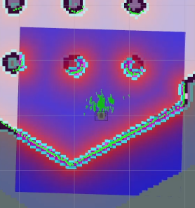
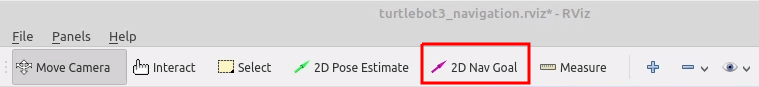

## Prerequisites

Before you can run the node, make sure you have the following installed:
- [ROS (Robot Operating System)](http://wiki.ros.org/ROS/Installation)
- [TurtleBot3](https://emanual.robotis.com/docs/en/platform/turtlebot3/quick-start/)


**NOTE:** We are using ROS Noetic

## Installation

1.  **Make workspace (e.g. catkin_ws)**

     ```bash
    cd ~
    mkdir catkin_ws
    cd catkin_ws/
    ```

2.  **Clone the Repository**

    ```bash
    git clone https://github.com/niweshsah/Task1_Deimos_NiweshSah.git
    ```

3. **Build the Package**

    Ensure you are in the workspace root directory (e.g., `catkin_ws`).

    ```bash
    catkin init
    catkin build
    ```
4. **Sourcing and setting the environment variables**:

     Type " nano ~/.bashrc " in terminal and add following lines at the end:

     ```bash
    source /opt/ros/noetic/setup.bash
     export TURTLEBOT3_MODEL=burger
     source ~/catkin_ws/devel/setup.bash
    ```

     Save the file and open terminal:
     ```bash
    source ~/.bashrc
    ```
        

## Making the map of our world

To run the node, use the following command:

```bash
rosrun main_launch map_making.py 
```

This will start 4 terminals:
1. Rosmaster
2. Gazebo world simulation with turtlebot3
3. SLAM with gmapping
4. Teleoperation node
   
Run the teleoperation node and make a map of the world. When the map is created successfully, open a new terminal and save the map.
```bash
rosrun map_server map_saver -f ~/map 
```
We saved at home directory (you can choose another location also) 

## Launching Autonomous Navigation Nodes

To run the node, use the following command:

```bash
rosrun main_launch python_start_launches.py 
```
This will start 4 terminals:
1. Rosmaster
2. Gazebo world simulation with turtlebot3
3. RVIZ
4. Teleoperation node

## Initial Pose Estimation 

1. Click the 2D Pose Estimate button in the RViz menu.

2. Click on the map where the actual robot is located and drag the large green arrow toward the direction where the robot is facing.
3. Repeat step 1 and 2 until the LDS sensor data is overlayed on the saved map.
4. Use keyboard teleoperation node to precisely locate the robot on the map.
5. Move the robot back and forth a bit to collect the surrounding environment information and narrow down the estimated location of the TurtleBot3 on the map which is displayed with tiny green arrows.

<p float="left">
  
  
</p>

6. Terminate the keyboard teleoperation node by entering Ctrl + C to the teleop node terminal in order to prevent different cmd_vel values are published from multiple nodes during Navigation.

## Set Navigation Goal
1. Click the 2D Nav Goal button in the RViz menu.

2. Click on the map to set the destination of the robot and drag the green arrow toward the direction where the robot will be facing.
.  This green arrow is a marker that can specify the destination of the robot.
.  The root of the arrow is x, y coordinate of the destination, and the angle θ is determined by the orientation of the arrow.
.  As soon as x, y, θ are set, TurtleBot3 will start moving to the destination immediately.


## Demo Video


## Resources Used

1. https://emanual.robotis.com/docs/en/platform/turtlebot3/overview/
2. https://gazebosim.org/docs
3. https://wiki.ros.org/Documentation
